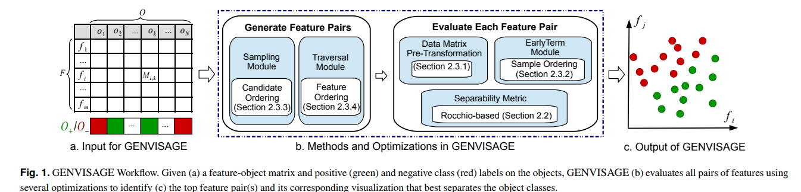

# *Genvisage* - Rapid Identification of Discriminative Feature Pairs for Genomic Analysis
Silu Huang [shuang86@illinois.edu] Charles Blatti [blatti@illinois.edu], Saurabh Sinha, and Aditya Parameswaran

KnowEnG BD2K Center of Excellence  
University of Illinois Urbana-Champaign  

## Table of Contents
1. [Motivation](#motivation)
2. [Installation](#installation)
3. [Tutorial](#tutorial)
	1. [Feature-object Matrix](#Feature-object-Matrix)
    2. [Creating Gene Sets](#creating-gene-sets)
    3. [Selecting Genvisage Algorithm](#Selecting-Genvisage-Algorithm)
    4. [Example Genvisage Run](#Example-Genvisage-Run)
4. [Command Configs](#Command-Configs )

## Motivation

A fundamental, but challenging problem in the analysis of genomics datasets is the separability task: discovering features that most strongly capture the difference between two different classes (sets) of biological objects with high dimensional feature representations, such as gene signatures described by their transcriptomic profiles, or genes described by their functional annotations. This problem is typically addressed by finding discriminative, significant single features using univariate statistical methods, or by identifying difficult-to-interpret multi-feature combinations using time-intensive machine learning algorithms. We sought a middle ground that is simultaneously rapid, interpretable, salient, and significant.

Our tool, Genvisage, enables researchers to interactively identify visually interpretable, significant feature pairs that strongly separate two classes. This repository is essentially the backend of [our webserver](http://genvisage.knoweng.org:443), which embodies one possible use case of Genvisage, where the user wants to find pairs of Gene Ontology functional annotation terms that when considered together are especially good at distinguishing the genes of two separate user-submitted gene sets.

[Return to TOC](#table-of-contents)

## Installation

### Local copy of Genvisage repository

If you wish to use the sample files necessary to complete this tutorial or the datasets from the paper, first clone this repository from github:
```
git clone https://github.com/slhuang/Genvisage.git
```


[Return to TOC](#table-of-contents)

## Tutorial

This section of the README is meant to walk a user through a process of using Genvisage to rapidly identify pairs of interacting functional annotations that are able to discriminate between two distinct gene sets. We first give an overview picture of how Genvisage works.



### Feature-object Matrix
The user can use their own feature-object matrix for analysis, where the value in each cell denotes the feature value for each corresponding gene. The format of feature matrix can be found [here](#-matrixF). 

User can also use [our provided feature-gene matrix](data/feature_gene_scale.selected.txt) with 3,632 Gene Ontology annotation terms as the features and with 22,210 gene objects. Rather than being a 0/1 membership indicator matrix, the features of this matrix represent the diffusion of the gene across a heterogeneous network of prior knowledge about the annotation of and the relationships between genes (see [DRaWR](https://www.ncbi.nlm.nih.gov/pubmed/27153592) method for more details). The prior knowledge in the heterogeneous network used here included annotations from [Gene Ontology](http://www.geneontology.org/), [KEGG](https://www.genome.jp/kegg/), [Reactome](https://reactome.org/), and [Pfam](https://pfam.xfam.org/) as well as gene-gene relationships from protein similarity defined by [BLASTP](https://blast.ncbi.nlm.nih.gov/Blast.cgi?PAGE=Proteins). After diffusion was performed, 3,632 Gene Ontology terms were extracted creating a term-gene matrix where each value represents the scaled probability that a random walk started at the gene would be at the Gene Ontology term. 

### Creating Gene Sets

The first step is to create two gene sets for discriminative analysis, i.e., positive gene set vs. negative gene set, each stored in one file. The file format should list one gene name on each row. We also allow users to only input one positive gene set. In this instance, Genvisage will use all of the remaining genes in your feature-gene matrix as the negative gene set.   

As an example, uses can also [our provided positive gene set](data/DELYS_THYROID_CANCER), which contains 675 differentially expressed genes between papillary thyroid carcinoma (PTC) compared to normal tissue as the positive gene set. These genes were downloaded from the Molecular Signature Database (MSigDB) ([up regulated](http://software.broadinstitute.org/gsea/msigdb/cards/DELYS_THYROID_CANCER_UP.html), [down regulated](http://software.broadinstitute.org/gsea/msigdb/cards/DELYS_THYROID_CANCER_DN.html)) and the original publication can be found [here](https://www.ncbi.nlm.nih.gov/pubmed/17621275). Since only a positive gene set is provided, the remaining genes in the feature-object matrix will be used as the negative set for the example.

### Selecting Genvisage Algorithm

The user can select different modes of the Genvisage algorithm to mine the underlying feature-object matrix for pairs of Gene Ontology terms whose gene scores separate the positive and negative classes of genes. All of these methods make use of the Rocchio-based separability metric and a transformation of the underlying feature-object matrix for greater computational efficiency. The user can select one of the three algorithmic modes (briefly described below) depending on their desire for greater accuracy or speed in finding the top feature pairs.

#### EarlyOrdering Mode
This method is the most accurate method for identifying top ranking pairs of separating features. It evaluates all possible feature pair candidates using the most accurate scoring that considers all possible genes. It has optimization over baseline methods by maintaining an upper bound for the separability error of the top-k feature pairs and terminating early when a feature pair's error exceeds this upper bound. We also further enhance this mode by scoring the "problematic" genes first.

#### SampOpt Mode
This method is faster that the EarlyOrdering mode because rather than fully evaluating each feature pair, we first calculate the confidence interval of its separability accuracy by performing a faster evaluation on a subsampled set of genes rather than all genes. We can extract the likely top feature pair candidates by comparing the confidence intervals and only perform the full accuracy evaluation for those feature pairs. We further enhanced this mode by ordering the candidate feature pairs which enables the early termination possibility of not having to evaluate all candidates before finding the top-k. This mode is less accurate than EarlyOrdering because true top feature pairs may not be selected ascandidates from their evaluation on the sampled genes.

#### HorizSampOpt Mode
This mode is the fastest method because it rather than sampling and evaluating all possible feature pairs, it greedily only examines 500,000 feature pairs for possible candidates. These feature pairs will be selected by having at least one of their two features being a good single feature separator of the positive and negative gene sets in its own right. This mode is the least accurate because not only might true top feature pairs not be identified as candidates, they might not be considered at all.

### Example Genvisage Run

Now that we have our gene sets and our feature-gene matrix prepared, we are ready to run Genvisatge. We first compile the program:
```
g++ -o rocchio rocchio.c -O3 -std=c++11
```
Next, we will first illustrate some example runs. Here we only input one positive gene set and treat all other genes in the feature-gene matrix as negative. We will describe the meaning of each parameters in the command in the next [section](#command-configs).

#### EarlyOrdering Mode Command
```
./rocchio -matrixF /path/to/your/feature-matrix -expF /path/to/your/positive-gene-set -outDir /path/to/your/output_fir -weighted -earlyT -sortG 
```

#### SampOpt Mode Command

```
./rocchio -matrixF /path/to/your/feature-matrix -expF /path/to/your/positive-gene-set -outDir /path/to/your/output_fir -weighted -samplOpt
```

#### HorizSampOpt Mode Command

```
./rocchio -matrixF /path/to/your/feature-matrix -expF /path/to/your/positive-gene-set -outDir /path/to/your/output_fir -weighted -samplOpt -Fconsider 500000 -sortF 
```


## Command Configs 
Next, we describe the different parameters in the running command.

### -matrixF
The string after -matrixF specifies the file storing the feature-gene matrix we will use in Genvisage. The first row in the file depicts the feature names. Afterwards, each row in the file represents a gene, starting with the gene name, followed by the feature values separated by comma. Please refer to [our provided feature-object matrix](data/feature_gene_scale.selected.txt) for example.

### -expF
The default experiment discriminates the input positive genes from all the remaining genes in the feature-gene matrix. The string after -expF specifies the file storing the positive gene set. Each row in the file is a gene. Please refer to [our provided positive gene set](data/DELYS_THYROID_CANCER). 

The user can perform Genvisage to discriminate an input positive gene set from another input negative gene set, by adding "-pos_neg" in the command line and specifying the positive gene get file after "-expF" and negative gene set file after "-expF2". An example command is as below:   

```
./rocchio -matrixF /path/to/your/feature-matrix -pos_neg -expF /path/to/your/positive-gene-set -expF2 /path/to/your/negative-gene-set -outDir /path/to/your/output_fir -weighted -earlyT -sortG 
```

### -outDir
The string after -outDir specifies the directory to store the output files, e.g., top_k single feature, top-k feature pairs, running time, etc.

### -weighted
In order to handle inbalance between the number of positive genes and negative genes, we can add "-weighted" in the run command such that the weighted number of positive genes and negative genes are the same. This is particular useful when the input positive gene size is in hundreds, while the remaining negative gene size is in tens of thousands.


### -earlyT
This flag enables early termination by maintaining an upper bound for the separability error of the top-k feature pairs and thus can terminate early when a feature pair's error exceeds this upper bound. This flag is used in EarlyOrdering Mode

### -sortG
This flag enables gene sorting based on single feature property before evaluating each feature pair, such that the algorithm can first examine the "problematic" genes and thus enhance the EarlyOrdering Mode.

### -samplOpt
This flag corresponds the [SampOpt Mode](#SampOpt-Mode).

### -Fconsider 
Instead of evaluating all possible feature pairs, it greedily only examines a subset of (e.g., 500,000) feature pairs for possible candidates. This number is specified after "-Fconsider".

### -sortF
This flag first sort features based on single feature property, and then traverse the feature pairs in this sorted feature ordering. This is especially useful when we only consider a subser of feature pairs as the candidates, i.e., [-Fconsider](#-Fconsider), since "-sortF" essentially helps select the good candidate feature pairs.

### -vertical
This flag defines the feature pair traversal ordering. In vertical traversal, we require both features perform well on their own in order to form a feature pair candidate. The default is horizontal traversal as in [HorizSampOpt Mode](#HorizSampOpt-Mode), where at least one feature performs well on its own and we pair it with all other features and form a feature pair candidate. This flag is usually coupled with "-sortF", otherwise, different traversal mechanism is simply randomly picking feature pairs.  

[Return to TOC](#table-of-contents)